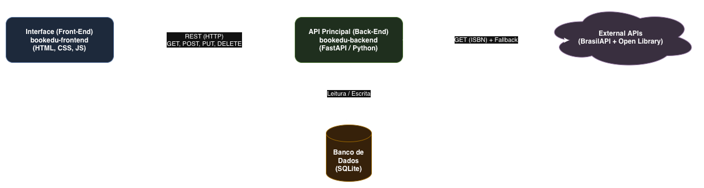

# School Library API (Back-End)

API principal para o MVP de gestão de acervo escolar, desenvolvida em Python com FastAPI e SQLite.

## Arquitetura e APIs Externas
Para enriquecer o cadastro de forma automatizada e garantir a estabilidade do sistema (arquitetura com fallback), este serviço consome duas APIs públicas e gratuitas baseadas no ISBN do livro:
* **BrasilAPI (Tentativa Principal):** `GET https://brasilapi.com.br/api/isbn/v1/{isbn}`
* **Open Library API (Fallback/Contingência):** `GET https://openlibrary.org/isbn/{isbn}.json`



## Instalação e Execução (Docker)
Este repositório contém o `Dockerfile` na raiz com as instruções de implementação para execução via contêineres.

1. Clone este repositório:
```bash
git clone https://github.com/lucianacoda/bookedu-backend.git
cd bookedu-backend
```

2. Construa a imagem Docker:
```bash
docker build -t api-biblioteca .
```

3. Execute o contêiner:
```bash
docker run -p 8000:8000 api-biblioteca
```

A documentação interativa (Swagger) estará em: `http://localhost:8000/docs`
